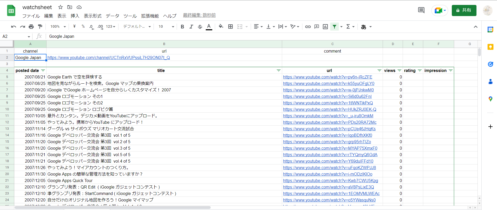

# watchsheet

spreadsheet で Youtube チャンネルの簡単な視聴管理

spreadsheet だと共有して外部に公開もできて便利だし CSV に変換できるので作ってみた

## 特徴

- 動画情報の取得や差分の更新が可能
- 表のフォーマットは固定
- フィルタを自動で適用

# example

[Google Japan](https://www.youtube.com/@GoogleJapan)の YouTube チャンネルの動画情報を取得したときの例

